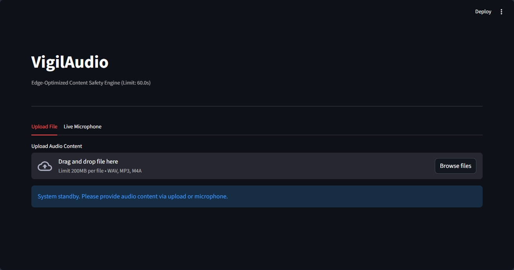

# VigilAudio: AI-Powered Audio Moderation Engine

**A production-ready audio emotion classification system built for content moderation.**

VigilAudio is an advanced audio analysis engine designed to detect aggression, distress, and safety risks by analyzing the *tone* of voice. It is the audio foundation of a multimodal moderation suite, utilizing fine-tuned Transformers and optimized for high-speed CPU inference.



## Key Features

*   **State-of-the-Art Architecture:** Fine-tuned Quantized `Wav2Vec2` Transformer (84% Accuracy).
*   **Real-time Streaming:** WebSocket API for low-latency audio processing (199ms).
*   **Active Learning:** Automatically captures low-confidence samples to build a "Data Flywheel."
*   **Moderation Alerts:** UI automatically flags high-intensity negative emotions (Anger, Fear).
*   **Edge Optimized:** INT8 Quantized ONNX model runs 2x faster than PyTorch.

## Performance (ONNX INT8)

| Model Version | Accuracy | Latency (ms) | Speedup | Size (MB) |
|---------------|----------|--------------|---------|-----------|
| PyTorch (Full) | 82.0% | 370ms | 1.00x | 361MB |
| ONNX (Standard) | 82.00% | 306.52ms | 1.21x | 361.0MB |
| **ONNX (INT8)** | **84.0%** | **199ms** | **1.85x** | **116MB** |

---

## Prerequisites

*   **Python 3.10+**
*   **uv:** [Install uv](https://docs.astral.sh/uv/getting-started/installation/).
*   **FFMPEG:** Required for audio processing.
    *   *Windows:* `winget install ffmpeg`
    *   *Linux:* `sudo apt install ffmpeg`

---

## How to Run (Deployment Modes)

### 1. Setup Environment
```bash
git clone https://github.com/yourusername/vigilaudio.git
cd vigilaudio
uv sync
```

### 2. Download Model Weights
1. Download `wav2vec2_model.zip` from [Releases].
2. Extract to `models/onnx_quantized/`.

### 3. Mode A: Standalone Demo (Recommended)
Runs the entire app (Model + UI) in one process. Best for Hugging Face Spaces.
```bash
uv run streamlit run src/ui/app_standalone.py
```
*   **Access:** `http://localhost:8501`

### 4. Mode B: Microservices (Production)
Decouples the API from the UI. Supports real-time WebSockets.

**Terminal 1 (Backend API):**
```bash
uv run uvicorn src.api.app:app --host 0.0.0.0 --port 8000
```

**Terminal 2 (Frontend UI):**
```bash
uv run streamlit run src/ui/app.py
```

---

## Development Workflow

If you want to retrain or modify the system:

### 1. Data Preparation
1. Download the [Kaggle Dataset](https://www.kaggle.com/datasets/uldisvalainis/audio-emotions).
2. Place folders in `data/raw/Emotions/`.
3. Run harmonization: `uv run src/data/harmonize.py`

### 2. Cloud Training
We use Google Colab (T4 GPU) for high-speed fine-tuning.
*   The training script and notebook are in `docs/VigilAudio_Fine_Tuning.ipynb`.

### 3. Optimization
Convert to ONNX and verify performance:
```bash
uv run src/models/optimize.py
uv run src/models/benchmark.py
```

## System Limitations

1.  **Analysis Cap:** To ensure low latency and prevent server overload, file uploads are currently limited to the first **60 seconds** of audio. Content beyond this mark is truncated.
2.  **Domain Gap:** The model is trained on studio-quality data. Performance may degrade on highly noisy or low-quality user recordings (e.g., wind noise, distant microphones).
3.  **Language:** The model is primarily trained on English speech patterns.

## License
MIT
